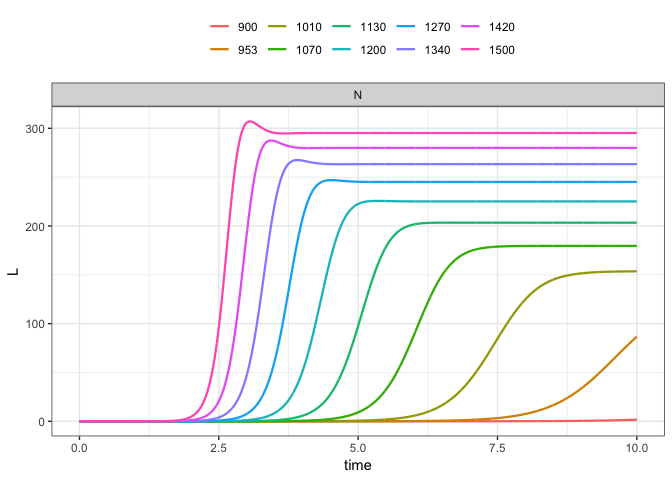
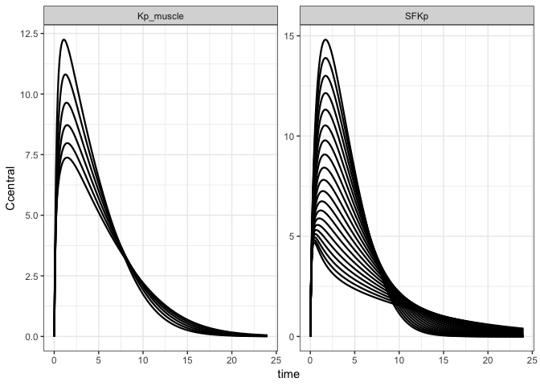
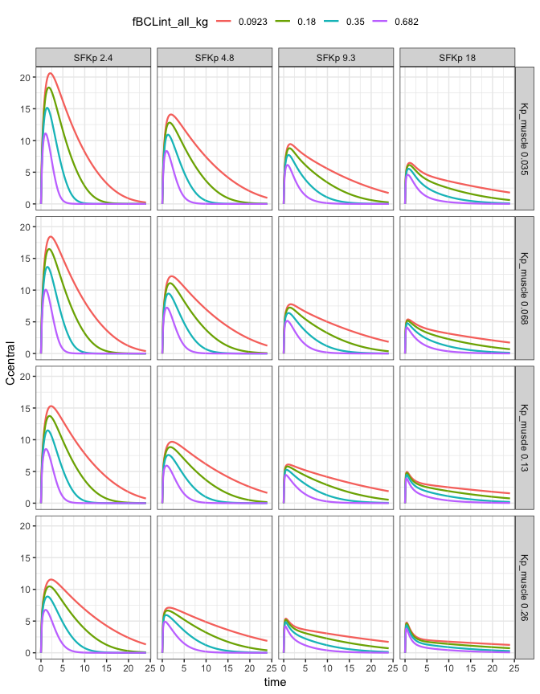
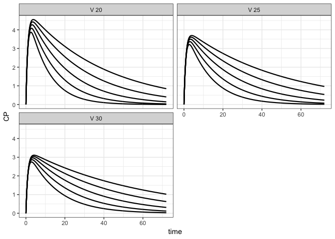

parseq: sensitivity analyses on sequences of parameters for mrgsolve
================

``` r
library(parseq)
```

``` r
mod <- mread("pk1", modlib(), end = 48, delta=0.1)

param(mod)
```

    . 
    .  Model parameters (N=3):
    .  name value . name value
    .  CL   1     | V    20   
    .  KA   1     | .    .

Sensitivity analysis by factor
------------------------------

The nominal (in model) parameter value is divided and multiplied by a factor, generating minimum and maximum bounds for simulating a sequence of parameter values

``` r
mod %>% 
  ev(amt = 100) %>% 
  parseq_factor(CL,V,.n=8) %>% 
  sens_each() %>% 
  sens_plot(CP)
```


Sensitivity analysis on a range
-------------------------------

``` r
mod %>% 
  ev(amt = 100) %>% 
  parseq_range(CL=c(1,2), V = c(10,30), .n =7) %>% 
  sens_each() %>% 
  sens_plot(CP)
```



Sensitivity analyis on custom sequences
---------------------------------------

``` r
mod %>% 
  ev(amt = 100) %>% 
  parseq_manual(
    CL = c(0.8,1, 1.2,1.7,2.2), 
    V = c(10,35,50)
  ) %>% 
  sens_each() %>% 
  sens_plot(CP)
```



``` r
mod %>% 
  ev(amt = 100) %>% 
  parseq_manual(
    CL = fct_seq(mod$CL, .n = 7), 
    V = geo_seq(10, 50, .n = 4)
  ) %>% 
  sens_each() %>% 
  sens_plot(CP)
```



Simulate a grid
===============

To this point, we have always used `sens_each` so that each value for each parameter is simulated one at a time. Now, simulate the grid or all combinations.

``` r
library(ggplot2)

mod %>% 
  ev(amt = 100) %>% 
  parseq_manual(
    CL = fct_seq(mod$CL, .n = 5, .factor = 2), 
    V = c(20,25,30)
  ) %>% 
  sens_grid(end = 72) %>% 
  sens_plot(CP, ncol=2)
```


