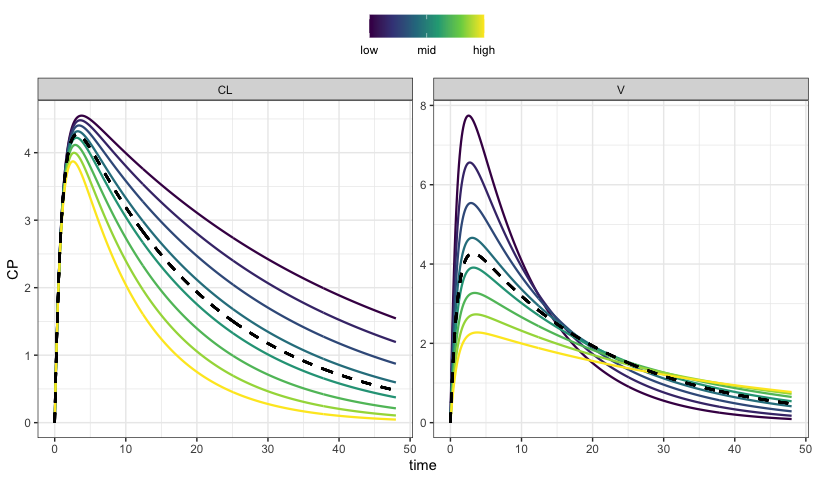
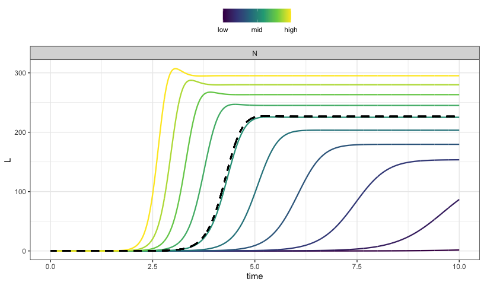
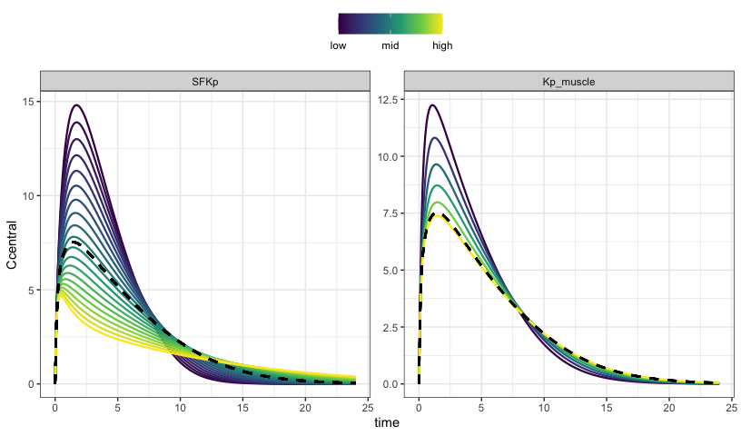

parseq: sensitivity analyses on sequences of parameters for mrgsolve
================

A simple, clean workflow for simulating from a model across sequences of
parameters.

<hr>

<BR>

``` r
library(parseq)
```

    . Loading required package: mrgsolve

    . 
    . Attaching package: 'mrgsolve'

    . The following object is masked from 'package:stats':
    . 
    .     filter

``` r
mod <- mread("pk1", modlib(), end = 48, delta = 0.1)
```

    . Building pk1 ... done.

``` r
param(mod)
```

    . 
    .  Model parameters (N=3):
    .  name value . name value
    .  CL   1     | V    20   
    .  KA   1     | .    .

## PK model sensitivity analysis by factor

The nominal (in model) parameter value is divided and multiplied by a
factor, generating minimum and maximum bounds for simulating a sequence
of parameter values

``` r
out <- 
  mod %>% 
  ev(amt = 100) %>% 
  parseq_factor(CL, V, .n=8) %>% 
  sens_each() 

sens_plot(out, "CP")
```

    . Loading required namespace: cowplot

<!-- -->

The simulated data is returned in a long format

``` r
out
```

    . # A tibble: 23,232 x 7
    .    case  time p_name p_value dv_name dv_value ref_value
    . * <int> <dbl> <chr>    <dbl> <chr>      <dbl>     <dbl>
    . 1     1     0 CL         0.5 EV             0         0
    . 2     1     0 CL         0.5 EV             0       100
    . 3     1     0 CL         0.5 CENT           0         0
    . 4     1     0 CL         0.5 CENT           0         0
    . 5     1     0 CL         0.5 CP             0         0
    . # … with 23,227 more rows

## HIV viral dynamic model

We look at latent infected cell pool development over ten years at
different “burst” size, or the number of HIV particles released when one
cell lyses.

``` r
mod <- mread("hiv", "inst/example")
```

    . Building hiv ... done.

``` r
mod %>% 
  update(end = 365*10) %>%
  parseq_range(N = c(900,1500), .n = 10) %>%
  sens_each(tscale = 1/365) %>% 
  sens_plot("L")
```

<!-- -->

## Sensitivity analysis on custom sequences

The model is rifampicin PBPK.

``` r
mod <- mread("inst/example/rifampicin.cpp") %>% update(delta = 0.1)
```

    . Building rifampicin_cpp ... done.

``` r
mod %>% 
  ev(amt = 600) %>% 
  parseq_manual(
    SFKp = fct_seq(.$SFKp, .n = 20), 
    Kp_muscle = even_seq(0.001, 0.1, .n = 6)
  ) %>% 
  sens_each() %>% 
  sens_plot("Ccentral")
```

<!-- -->

# Simulate a grid

To this point, we have always used `sens_each` so that each value for
each parameter is simulated one at a time. Now, simulate the grid or all
combinations.

We use `parseq_cv` here, which generates lower and upper bounds for the
range using 50% coefficient of variation.

``` r
library(ggplot2)

mod %>% 
  ev(amt = 600) %>% 
  parseq_cv(fBCLint_all_kg, SFKp, Kp_muscle, .n = 4, .cv = 50) %>% 
  sens_grid() %>% 
  sens_plot(Ccentral)
```

<!-- -->
