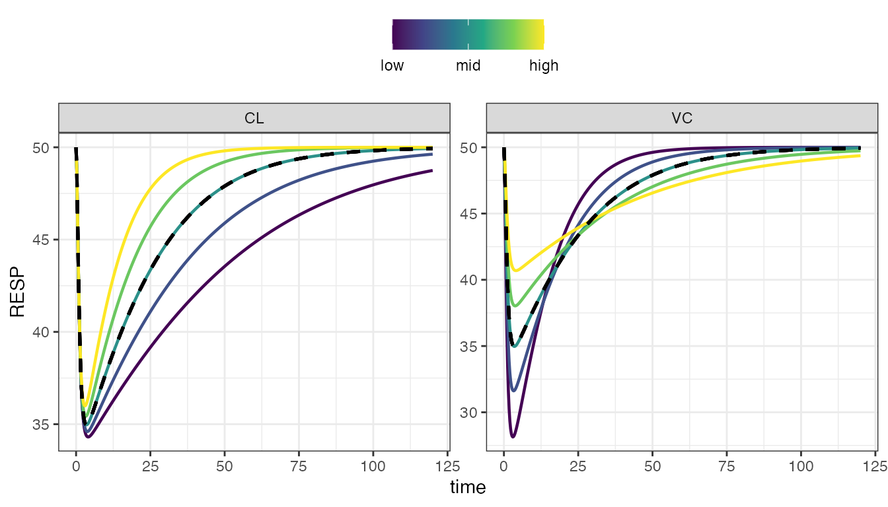
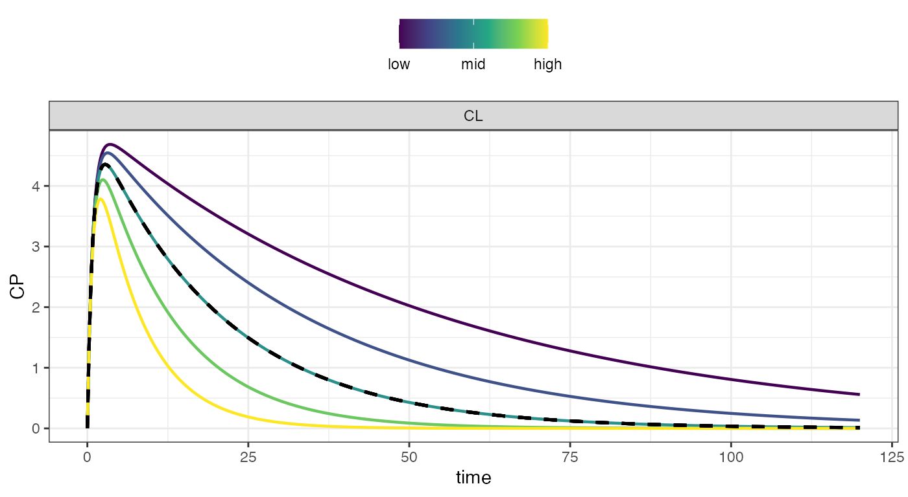
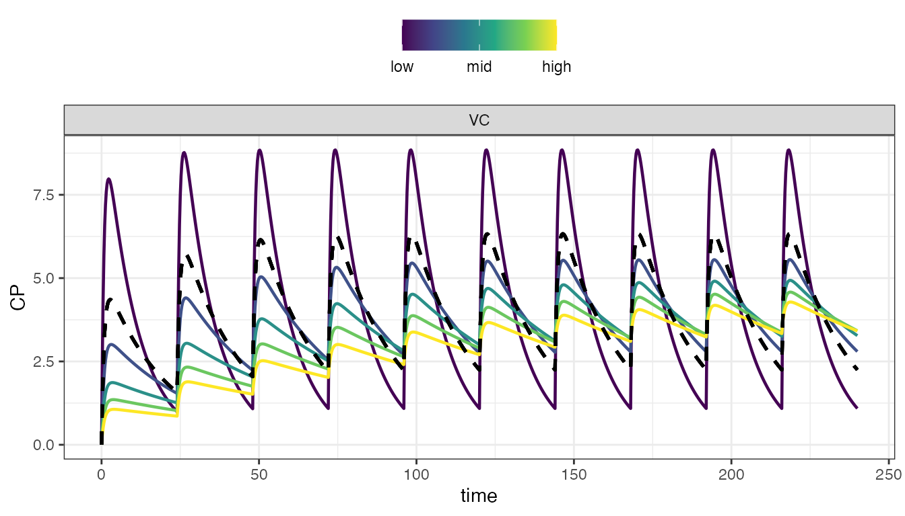
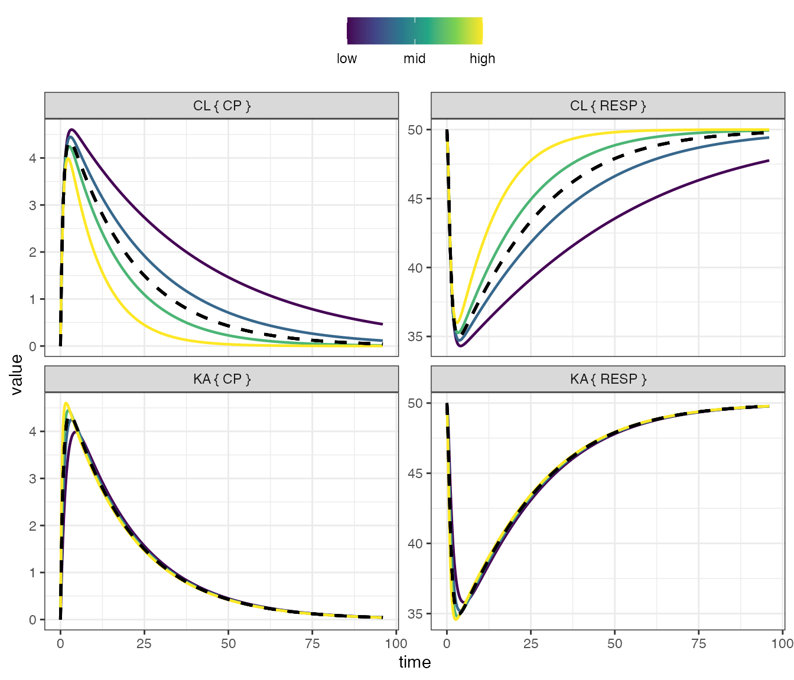
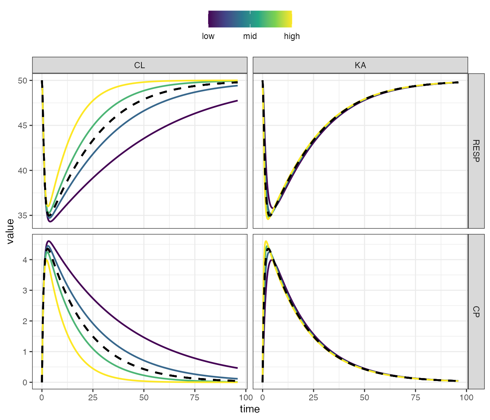
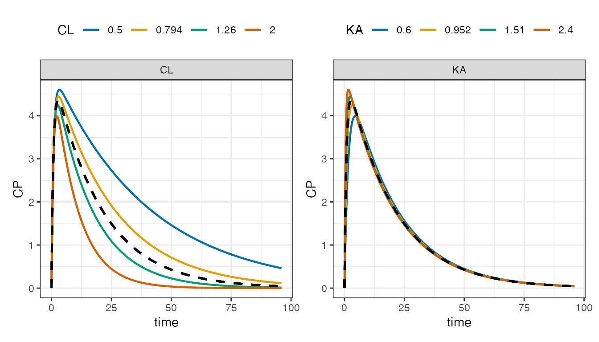
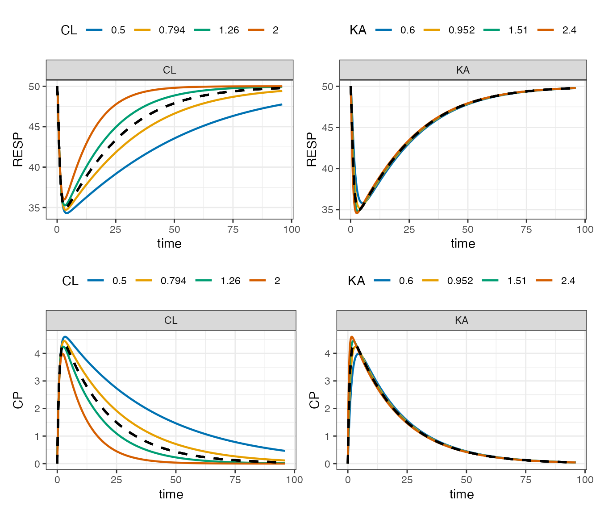
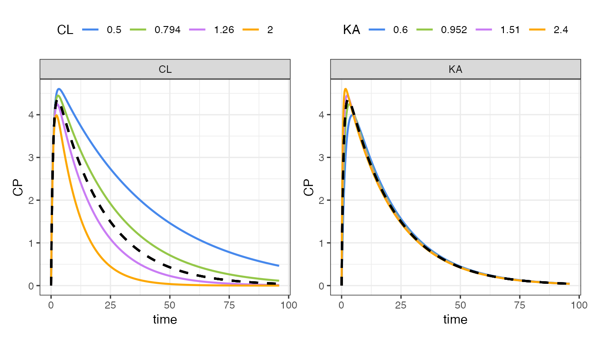

# Get started

``` r

library(dplyr)
library(mrgsim.sa)
library(patchwork)
library(ggplot2)
```

mrgsim.sa is a package that allows you to do various types of ad-hoc or
local sensitivity analysis for models written in mrgsolve. This vignette
will help you get started.

By “ad-hoc” sensitivity analysis, I mean selecting some model parameters
of interest, varying them at certain discrete, systematic way,
simulating from those varied parameters and visualizing the outputs. For
example, “what happens when you double the value of a parameter or cut
it in half; lets plots outputs for parameters within those two extremes,
filling in with 3 or 4 values in between.”

So first, we need a model. This can be any model *you* write using the
mrgsolve package. Here, we’ll use the example `house` model provided by
mrgsolve

``` r

mod <- house(outvars = "CP,RESP")
```

This model has parameters

``` r

param(mod)
```

    . 
    .  Model parameters (N=14):
    .  name value . name  value
    .  CL   1     | SEX   0    
    .  D1   2     | SEXCL 0.7  
    .  F1   1     | SEXVC 0.85 
    .  IC50 10    | VC    20   
    .  KA   1.2   | WT    70   
    .  KIN  100   | WTCL  0.75 
    .  KOUT 2     | WTVC  1

and outputs

``` r

outvars(mod)
```

    . $cmt
    . [1] "RESP"
    . 
    . $capture
    . [1] "CP"

Let’s vary `CL` and `VC` and look at the `RESP` output.

As suggested in the example above, lets double and halve those
parameters, and look a total of 5 values between those extremes. Use the
[`parseq_fct()`](https://kylebaron.github.io/mrgsim.sa/reference/parseq_fct.md)
function after selecting the parameters you want to vary

``` r

out <- 
  mod %>% 
  ev(amt = 100) %>% 
  parseq_fct(CL, VC, .factor = 2, .n = 5) %>% 
  sens_each()
```

The “base” value for each parameter is whatever is currently in the
model; in this case it is

``` r

param(mod)[c("CL", "VC")]
```

    . $CL
    . [1] 1
    . 
    . $VC
    . [1] 20

Passing the `.factor` argument as 2 means multiply those base values by
2 for the upper extreme and 1/2 for the lower extreme. The `.n` argument
says to fill in 5 parameter values between those two extremes.

The
[`sens_each()`](https://kylebaron.github.io/mrgsim.sa/reference/sens_fun.md)
function call above tells you to vary `CL` and `VC` one at a time.

The output is a tibble in long format, with class `sens_each`

``` r

out
```

    . 
[38;5;246m# A tibble: 9,680 × 7
[39m
    .     case  time p_name p_value dv_name dv_value ref_value
    .  
[38;5;250m*
[39m 
[3m
[38;5;246m<int>
[39m
[23m 
[3m
[38;5;246m<dbl>
[39m
[23m 
[3m
[38;5;246m<chr>
[39m
[23m    
[3m
[38;5;246m<dbl>
[39m
[23m 
[3m
[38;5;246m<chr>
[39m
[23m      
[3m
[38;5;246m<dbl>
[39m
[23m     
[3m
[38;5;246m<dbl>
[39m
[23m
    . 
[38;5;250m 1
[39m     1  0    CL         0.5 RESP       50        50   
    . 
[38;5;250m 2
[39m     1  0    CL         0.5 RESP       50        50   
    . 
[38;5;250m 3
[39m     1  0    CL         0.5 CP          0         0   
    . 
[38;5;250m 4
[39m     1  0    CL         0.5 CP          0         0   
    . 
[38;5;250m 5
[39m     1  0    CL         0.5 RESP       50        50   
    . 
[38;5;250m 6
[39m     1  0    CL         0.5 RESP       50        50   
    . 
[38;5;250m 7
[39m     1  0    CL         0.5 CP          0         0   
    . 
[38;5;250m 8
[39m     1  0    CL         0.5 CP          0         0   
    . 
[38;5;250m 9
[39m     1  0.25 CL         0.5 RESP       48.7      48.7 
    . 
[38;5;250m10
[39m     1  0.25 CL         0.5 CP          1.29      1.29
    . 
[38;5;246m# ℹ 9,670 more rows
[39m

``` r

class(out)
```

    . [1] "sens_each"  "tbl_df"     "tbl"        "data.frame"

Taking inventory of this output

``` r

count(out, p_name, dv_name)
```

    . 
[38;5;246m# A tibble: 4 × 3
[39m
    .   p_name dv_name     n
    .   
[3m
[38;5;246m<chr>
[39m
[23m  
[3m
[38;5;246m<chr>
[39m
[23m   
[3m
[38;5;246m<int>
[39m
[23m
    . 
[38;5;250m1
[39m CL     CP       
[4m2
[24m420
    . 
[38;5;250m2
[39m CL     RESP     
[4m2
[24m420
    . 
[38;5;250m3
[39m VC     CP       
[4m2
[24m420
    . 
[38;5;250m4
[39m VC     RESP     
[4m2
[24m420

We pass this output object to
[`sens_plot()`](https://kylebaron.github.io/mrgsim.sa/reference/sens_plot.md)
and name the variable we want to plot

``` r

sens_plot(out, "RESP")
```



There are other ways to vary parameters in the model

- [`parseq_fct()`](https://kylebaron.github.io/mrgsim.sa/reference/parseq_fct.md) -
  increase and decrease by a certain factor
- [`parseq_cv()`](https://kylebaron.github.io/mrgsim.sa/reference/parseq_cv.md) -
  increase and decrease by a certain coefficient of variation
- [`parseq_range()`](https://kylebaron.github.io/mrgsim.sa/reference/parseq_range.md) -
  manually specify the *range* for varying parameters
- [`parseq_manual()`](https://kylebaron.github.io/mrgsim.sa/reference/parseq_manual.md) -
  manually specify all values for the parameters

For example, to vary `CL` by 60% coefficient of variation, plotting 5
values between -2 and 2 sd and looking at `CP` output

``` r

mod %>% 
  ev(amt = 100) %>% 
  parseq_cv(CL, .cv = 50, .nsd = 2) %>% 
  sens_each() %>% 
  sens_plot("CP")
```



Or we can look at how `VC` influences approach to steady state

``` r

out <- 
  mod %>% 
  ev(amt = 100, ii = 24, addl = 10) %>%
  update(end = 240) %>% 
  parseq_manual(VC = seq(10,100,20)) %>% 
  sens_each()

sens_plot(out, "CP")
```



We can also look at multiple outputs on the same plot

``` r

out <- 
  mod %>% 
  ev(amt = 100) %>%
  parseq_fct(CL, KA, .n = 4) %>% 
  sens_each(end = 96)
```

The `facet_wrap` layout puts parameters in rows and outputs in columns

``` r

sens_plot(out, layout = "facet_wrap")
```



The `facet_grid` layout puts outputs in rows and parameters in columns

``` r

sens_plot(out, layout = "facet_grid")
```



You can also plot this in “grid” format, where the actual parameter
values are shown in the legend

``` r

sens_plot(out, dv_name = "CP", grid = TRUE)
```



Or look at multiple outputs

``` r

out %>% 
  select_sens(dv_name = "RESP,CP") %>% 
  sens_plot(grid = TRUE) %>% 
  patchwork::wrap_plots(ncol = 1)
```



Try a different palette

``` r

sens_plot(
  out, 
  "CP", 
  grid = TRUE,
  palette = ggsci::scale_color_atlassian()
)
```


